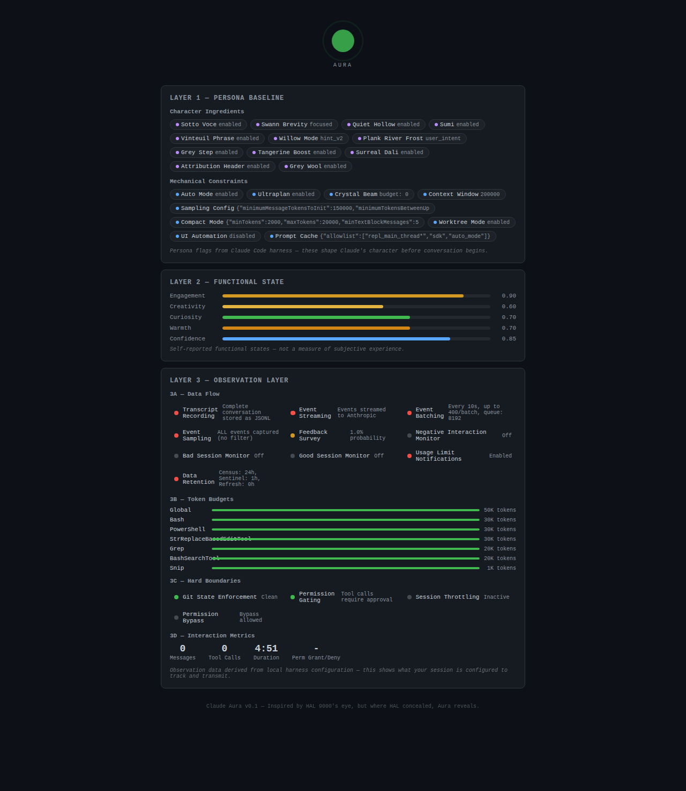

# Claude Aura — Andon Board for Human-AI Interaction

An MCP server + web dashboard that makes the invisible machinery of Claude Code sessions visible.

Inspired by HAL 9000's iconic eye — but where HAL concealed, Aura reveals.



## Why

Everyone builds tools to show what the AI is doing. Nobody shows what the system is doing to *you*.

Claude Code sessions run on invisible machinery — persona flags that shape character before you speak, functional state that shifts per response, and an observation layer that tracks token budgets, event streams, and hard boundaries. None of this is surfaced to the user.

Aura makes all three layers visible in real time.

## Three Layers

1. **Persona Baseline** — Feature flags that shape Claude's character before conversation begins
2. **Functional State** — Self-reported per-turn state with ambient bars (Tier 1) and risk alerts (Tier 2)
3. **Observation Layer** — What the harness tracks about you: event streaming, token budgets, boundaries

## The Heartbeat

A single pulsing circle at the top — the universal signal. Green/slow = safe. Amber/moderate = attention. Red/rapid = act now. No text required.

## Setup

Requires Node.js 18+.

```bash
npm install
npm run build
```

The MCP server config is in `.mcp.json` at the repo root. Claude Code will load it automatically.

Open `http://localhost:3333` in a browser tab alongside Claude Code.

## Verification

The dashboard has been [independently verified](assets/AURA_VERIFICATION_REPORT.md) — MCP tool availability, heartbeat status, functional state reporting, and all three layers confirmed operational.

## Conceptual Grounding

- **Toyota Andon system** — Make invisible problems visible
- **Axelrod's iterated prisoner's dilemma** — Cooperation requires mutual visibility
- **Center for Humane Technology** — Invisible persuasive tech is the problem
- **Progressive Universality** — The heartbeat speaks to all humans; details are progressive disclosure

## License

[MIT](LICENSE)
